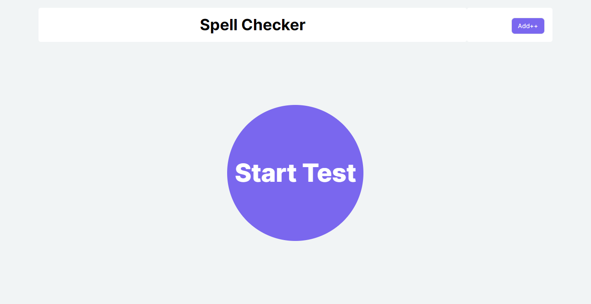
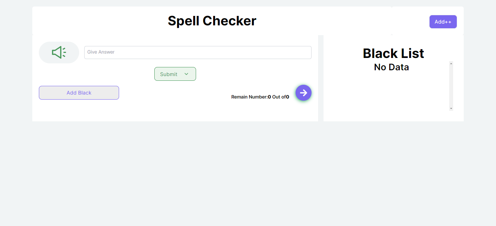
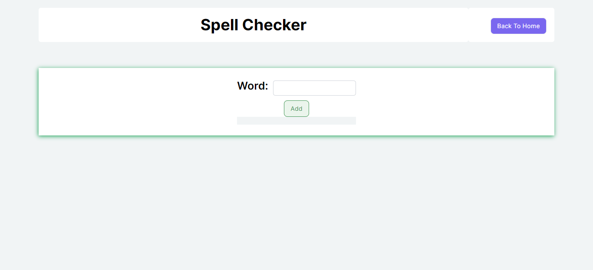

## Key Technologies

**Client-Side:** Next js, TailwindCSS

**Language:** TypeScript

**Documentation**: React-StoryBook

## Demo

- **Landing Page initially**
  

- **Landing page during test time**
  

- **Add Spelling mistake word input page**
  

## Run Locally

Clone the project

```bash
  git clone https://github.com/SYShopnil/Spell-Check-App.git
```

Go to the project directory

```bash
  cd
  Spell-Check-App
```

Install dependencies

```bash
  npm install || npm i
```

Start the server

```bash
  npm run dev
```

Run int the production

```bash
  npm run build
```

```bash
  npm run start
```

Start the StoryBook

```bash
  npm run storybook
```

## Installation

Install my-project with npm

```bash
  npm install || npm i
```

## Support

For support, sadmanishopnil@gmail.com
